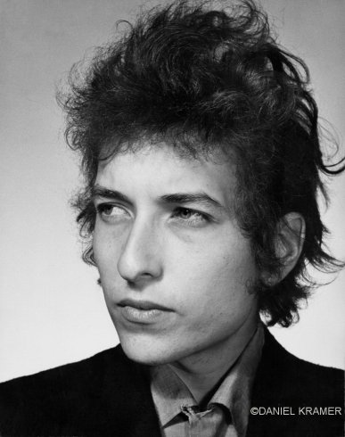

title: Inside Bob Dylan's Head

As a fan and an artist, my appreciation for Bob Dylan's craft
and artisan approach to music developed and deepened because of 
 my friendship with my friend Floyd in Salt Lake City.  

## Painting #1
 This is my attempt at a Bob Dylan portrait 
 based on the above photo of a young Bob Dylan taken by Daniel Kramer in 1965 New York.
 (See <a href="http://lightbox.time.com/2012/03/19/a-year-and-a-day-with-bob-dylan/#1">A Year 
 and a Day with Bob Dylan</a>)
 
My [first version](floyds-dreams-of-dylan-2013-03-23.jpg) is clearly not 
a pure or even a good copy of the photo, 
especially Dylan's lips, but definitely shows how amateur my 
painting style actual is compared to most trained artists. 

The second attempt I will use a technique of creating and printing the 
photograph and then transfer the grid to the painting.
Here is the grid attempt: 

 
### Grid Photo

## Painting #2
I've decided to continue this exploration of both Dylan and using a pirate radio. Here is
my first sketch:

